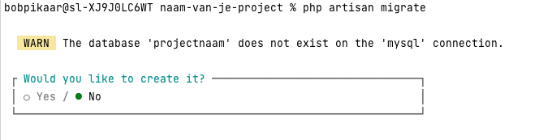

# Installatieproces

## Project aanmaken

Er wordt vanuit gegaan dat [Composer](https://getcomposer.org/doc/00-intro.md) geïnstalleerd is.

Maak een nieuw project op een locatie met projecten (niet in htdocs, problemen met rechten zoals images uploaden)

```bash
composer create-project laravel/laravel naam-van-je-project
```

Na het uitvoeren van het commando wordt in de map waar je staat een nieuwe folder gemaakt met de naam: **naam-van-je-project**

Open deze map in PHPStorm. Let erop dat de map met die naam de eerste folder is die je ziet in het overzicht van het project in PHPStorm.


## Database

Start XAMPP / WAMP. Zorg dat de databaseserver aanstaat. Wil je dit zeker weten start dan ook de Apache server en navigeer naar http://localhost/phpmyadmin/. Als je de databases kan zien betekent dit dat de server draait.

### Projectsettings

Open het `.env` bestand en verander de `APP_NAME` en `DB_DATABASE`

```bash
# Algemeen
APP_NAME=projectnaam # bedenk hier zelf een passende naam
APP_ENV=local
APP_KEY=base64:AvFlHWzYakMYu4UiGqrn8FzYXxfR3hzm3wgDY2k74= #Dit wordt gegenereerd
APP_DEBUG=true
APP_URL=http://localhost

# database
# De basisgegevens voor de database staan goed voor local development
DB_CONNECTION=mysql
DB_HOST=127.0.0.1
DB_PORT=3306
DB_DATABASE=projectnaam 
DB_USERNAME=root
DB_PASSWORD=
```

### Database aanmaken

Open de terminal in PHPStorm en voer het volgende commando uit

```bash
php artisan migrate
```

Omdat er nog geen database is aangemaakt krijgt je het volgende te zien



Gebruik de pijltjestoetsen en selecteer **Yes**.

De database wordt aangemaakt en de tabel voor de Users wordt alvast gemaakt.

## Development server starten

Om het resultaat van het Laravel project in de browser te kunnen zien, heb je een php server nodig. Deze wordt meegeleverd in het Laravel project en is met een commando in de **terminal** te starten

```bash
php artisan serve
```

De server wordt gestart en het url wordt weergegeven in de terminal. Met CTRL / CMD + click kun je het url openen in je browser.

Als het goed is zie je nu de default startpagina van Laravel.

**Gefeliciteerd, de installatie is geslaagd!**

## Laravel Idea Plugin
[Aanvragen licentie voor Laravel Idea plugin](laravelidea.md)